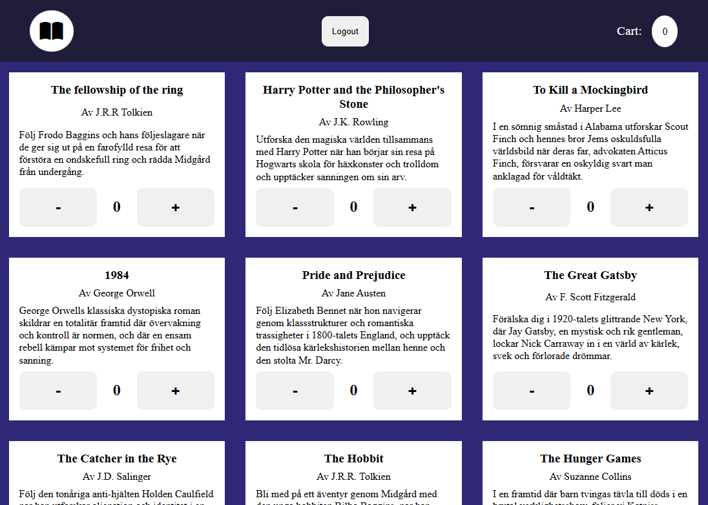
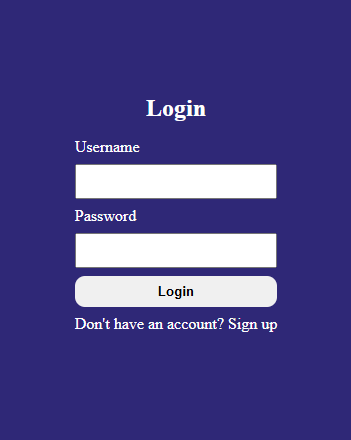
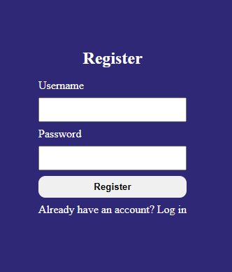

# Vecka 14: Book Store del 2 - Veckans Code Review-uppgift

Denna vecka återvänder vi till vår Bok Store-applikation för att applicera de nya tekniker vi lärt oss, samt repetera några gamla. Övningen består av ett antal steg, där svårighetsgraden hela tiden ökar något, och där ni gör så långt ni hinner / klarar av.

## Steg 1

Lägg till _Add to cart_-knappar på dina BookItems enligt skissen från [förra veckans uppgift](https://github.com/fu-react-fe24/week-13-exercise-props-bookstore). Klickar man på knappen så skall ni öka värdet som visas i _Cart_-indikatorn i _Header_. Tänk på att värdet aldrig kan vara mindre än 0.

## Steg 2

Ersätt dina knappar med en ny komponent som du döper till **Counter.jsx**. Denna skall ha default-värdet 0, och varje gång man klickar på _plus_/_minus_/ så skall värdet _minska_/_öka_. Värdet får dock aldrig bli mindre än 0. Se bild nedan för referens.



## Steg 3

Skapa komponenten **LoginForm.jsx**. Skapa en ny mapp i _src_ med namnet _data_, och i denna mapp skapar du filen **users.js**. I denna fil klistar du in nedanstående kod (ersätt gärna med egen data för användare).

```
const users = [
    {
        username: 'jesper',
        password: 'jesper123',
    }
];

export default users;
```

Skapa i **App.jsx** tillståndsvariabeln _activeUser_ som har defaultvärdet _null_. I din jsx så skall du nu OM _activeUser_ är lika med null visa inloggningsformuläret istället för din Book Store. Vid en lyckad inloggning sparar du ner den inloggade användaren i _activeUser_, och när denna tillståndvariabel inte längre är null så visar du din Book Store. Använd en _ternary operator_ för att bestämma vad som skall visas i vilket läge.



## Steg 4

Lägg till en _Logga Ut_-knapp någonstans i din Book Store. När knappen klickas skall användaren loggas ut och tas tillbaks till inloggningsformuläret.

## Steg 5

Lägg även till ett registreringsformulär där du kan skapa nya användare. Tänk då på att du inte kan lägga till nya användare i din array från **users.js**, utan du behöver istället spara ner denna array i en tillståndsvariabel, som du sen också kan uppdatera med din registrerade användare. Skapa även möjlighet för användaren att hoppa mellan **LoginForm** och **RegisterForm**. Detta gör bäst med en kombination av en _tillståndsvariabel_ och en _ternary operator_.


